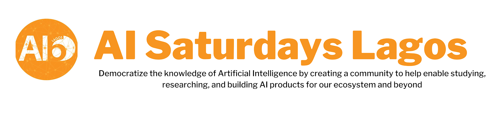

# AI Saturdays Lagos C9 - Flipped

The **Machine Learning (ML) Flipped Cohort** is a structured, community-driven Data Science and Machine Learning learning 12 weeks cohort designed for beginners. The goal is to equip individuals with foundational to intermediate ML knowledge using a flipped classroom model where learners independently consume pre-recorded content during the week, then attend a weekly community to discuss, explore and ask questions about what they’ve learned.

We follow a **flipped classroom model** where:
- Participants watch curated **pre-recorded lectures** and complete labs during the week.
- Every Saturday, attend a **community call** to engage with one of the organizers.

## What to Expect
Each week you will be:
- Assigned selected videos (from a curated playlist of lectures and labs)
- Receive supporting materials like Jupyter notebooks, slides, and assessments
- Join a **live Zoom session** on weekends to engage with instructors and peers
- Interact daily on **Discord** for Q&A, collaboration, and accountability

By the end of the cohort, you will:
- Participate in **capstone projects** and present your solution to  demonstrate real-world understanding
- Earn a certificate if all conditions are met (see below)

## Who is This For?

This cohort is ideal for:
- Students and recent graduates exploring data science or ML
- Career switchers with programming experience aiming to enter ML roles
- Self-learners seeking structure, mentorship, and a community
- You!

**Prerequisite**: Basic Python knowledge is expected  
> We’ll provide beginner-friendly Python resources during Week 1 for anyone needing a refresher.

## Program Duration

The cohort will run for **10–12 weeks**, broken down into:

- 10 weeks of structured learning
- Capstone projects

**Important Dates**
- Cohort Start Date: July 26, 2025
- Cohort End Date: October 18, 2025

## Weekly Format

Each week will follow this schedule:

- **Sundays**: Email regarding the videos, labs, notebooks and slides for the week will be sent to participants
- **Saturdays**: Complete and Submit Assessments 9:00 AM WAT on Saturdays
- **Saturdays**: Attend a 2-hour community discussion via Zoom (10-12 PM WAT)

> There will be an onboarding session on July 26th, at **10:00 AM WAT**.  

## Cohort Overview

| **Week** | **Dates**       | **Topics**                                                                                        | **Lectures**                                                                     | **Labs**                                                                   | **Assessment** | **Suggested Weekly Schedule**                                                                         |
| -------- | --------------- | ---------------------------------------------------------------------------------------------------------------- | -------------------------------------------------------------------------------- | -------------------------------------------------------------------------- | -------------- | ----------------------------------------------------------------------------------------------------- |
| 0        | Jul 26         | **Onboarding & Kickoff**         | - | - |- |-                                                                         |
| 1        | Jul 27 – Aug 2  | **Python & Numerical Computing**                         |☘️Python Refresher: [Lecture Video](https://www.youtube.com/watch?v=-nUIV5TOnl4) , [Lecture Notebook](https://drive.google.com/file/d/1eX7_L7MXEJnsmqgTYMAsYn7VPb12DyoZ/view)  ☘️Numerical Computing with Python and Numpy: [Lecture Video](https://www.youtube.com/watch?v=JKQU_zSaKys), [Lecture Notebook](https://drive.google.com/file/d/10WggieiU_AZ7Is7mQJu2uoaPtqX2tdwF/view)                             | -                                                                          | TBD            | **Mon**: Python Refresher Lecture  **Wed**: NumPy Lecture                   |
| 2        | Aug 3 – Aug 9   | **Data Science Foundations**| ☘️Introduction to Data Science: [Lecture Video](https://www.youtube.com/watch?v=gbU5QQ29OwM), [Lecture Slides](https://drive.google.com/file/d/1Oka9vKS0UrYQ8tFOXnjdTCEX8Wxp7s1L/view)  ☘️Data Collection and Scraping: [Lecture Video](https://www.youtube.com/watch?v=etIQ7sO0Tek), [Lecture Slides](https://docs.google.com/presentation/d/e/2PACX-1vQbpgl2nbHwqDCueVVYr5AztWGtiy5L3hjcPzw1_Ue_8aV9RH47mQVdx3ppyxVfuQ/pub?start=false&loop=false&delayms=3000&slide=id.p1) | 🍒Introduction to Git and Github: [Lab Video](https://www.youtube.com/watch?v=lzWE8WPXQGE), [Lab Slides](https://docs.google.com/presentation/d/e/2PACX-1vSSsaqYfElXQullRk5ESL_Kt1dMj2kTfUzCYjM4PMQ3xqKj66W_Jz4LYXQESY1sgQ/pub?start=false&loop=false&delayms=3000&slide=id.p1)  🍒Data Collection and Scraping: [Lab Video](https://www.youtube.com/watch?v=2ibGxJdRlsw), [Lab Notebook](https://drive.google.com/file/d/1u5lXsrUrJ6-l-hnwQK9VgSC0XYS0Mc8B/view)  | TBD            | **Mon**: Intro to DS Lecture  **Tue**: Intro + Git/GitHub Lab  **Wed**: Data Collection Lecture  **Thur**: Data Collection Lab                |
| 3        | Aug 10 – Aug 16 | **Databases, SQL & Exploratory Data Analysis**                                                        | ☘️Relational Data: [Lecture Video](https://www.youtube.com/watch?v=vTIbjzcbehE),  [Lecture Slides](https://docs.google.com/presentation/d/e/2PACX-1vS8mADD20oIArl342c_iob4fnxO66kgvOky_9RDhHGKwikRbbeC_9ItWBky8QkkUA/pub?start=false&loop=false&delayms=3000)   ☘️ Visualization and Data Exploration: [Lecture Video](https://www.youtube.com/watch?v=fFpM0KOTu6w), [Lecture Slides](https://docs.google.com/presentation/d/e/2PACX-1vQSEmEKIACb0uJhKZMG6qnzvk2IGRA78o9yonx3M6syO0ZIG5IG1-188fAbNltBag/pub?start=false&loop=false&delayms=3000&slide=id.p1)                                               | 🍒Relational Data and SQL: [Lab Video](https://www.youtube.com/watch?v=a0T7i4DiqNc), [Lab Notebook](https://drive.google.com/file/d/1lH5CIzCgaqBvgyh0WekYe9on9mRS-wnr/view)  🍒Data Exploration and Visualization: [Lab Video](https://www.youtube.com/watch?v=oQo2oJQ-poo), [Lab Notebook](https://drive.google.com/file/d/1QrnwD7C3S9jVAuVk6MsvF6kZVD8EMZ10/view)                                              | TBD            | **Mon**: Relational data Lecture  **Tue**: Relational data Lab  **Wed**: Data Exploration Lecture   **Thur**: Data Exploration Lab                             |
| 4        | Aug 17 – Aug 23 | **Math for ML**| ☘️Linear Algebra: [Lecture Video](https://www.youtube.com/watch?v=tClanqLla9o), [Lecture Notebook](https://drive.google.com/file/d/1Jy3pSrHwzD-9sf8WwwhRG1L_CQ9-WsCR/view), [Lecture Slides](https://docs.google.com/presentation/d/e/2PACX-1vQZhjofwXlAENMgwCK0xe3fXkg0PW1TELmS5ZGeaAhParqlYWJmG_tUcRaHshL3Ww/pub?start=false&loop=false&delayms=3000&slide=id.p1)                                            | -                                              | TBD            | **Mon:** Linear Algebra Lecture  **Wed**: Linear Algebra Notebook                                 |
| 5        | Aug 24 – Aug 30 | **Text Processing**                                        |  ☘️ Free Text and Natural Language Processing: [Lecture Video](https://www.youtube.com/watch?v=8RDDqw-ld4E), [Lecture Slides](https://docs.google.com/presentation/d/e/2PACX-1vTH-AFrXZR8sWxVKH4aauTZIN7YTXFNKktsRSA4agAoUGhl_-EsaYqITrrQXqc3sg/pub?start=false&loop=false&delayms=3000&slide=id.p1)          | 🍒Text Processing: [Lab Video](https://www.youtube.com/watch?v=pSWV2uE5OE8), [Lab Notebook](https://drive.google.com/file/d/1ywoAi4t_85q24A3DSdZzBQ96ezhdEkO8/view)                                                                          |             | **Mon**: Free Text & NLP Lecture   **Wed**: Text Processing Lab                    |
|  |  | | **Project Checkpoint** 
| 6        | Aug 31 – Sep 6  | **Linear Regression & Classification Models**                    | ☘️Introduction to Machine Learning & Linear Regression: [Lecture Video](https://www.youtube.com/watch?v=RqM3eaq-tcI), [Lecture Slides](https://drive.google.com/file/d/1abBmRN-y7WHwqPxnovZOZ3nYeyr-4pTl/view)  ☘️Linear Classification: [Lecture Video](https://www.youtube.com/watch?v=hXkOfdxAKyU), [Lecture Slides](https://docs.google.com/presentation/d/e/2PACX-1vT_cRs8vMzlsl7iS3DVLj1n7V9W2wY77YqDaCoF3yfY8vlHkbue9_CuT9ui_QEi5Q/pub?start=false&loop=false&delayms=3000&slide=id.p1)           | 🍒Linear Regression and Classification: [Lab Video](https://www.youtube.com/watch?v=SOr8UPv-gVE), [Lab Notebook](https://colab.research.google.com/drive/17FXbveD3FF7QRAr7lu1skVGKQamTebnj?usp=sharing) | TBD            | **Mon**: Introduction to ML Lecture   **Wed**: Linear Classification Lecture   **Thur** Linear Regression & Classification Lab |
| 7        | Sep 7 – Sep 13  | **Non-Linear Modeling & Interpretable ML**| ☘️Nonlinear Modeling, Cross-Validation: [Lecture Video](https://www.youtube.com/watch?v=-VUR7B7PHrQ), [Lecture Slides](https://docs.google.com/presentation/d/e/2PACX-1vRc3D1tUEVS2z0swhmYUf98R-ikPZRnYFHHNIbORCSRVCq3SVsg7JMk1TexsS2vqA/pub?start=false&loop=false&delayms=3000&slide=id.p1)  ☘️Decision Trees, Interpretable Models: Lecture Video, [Lecture Slides](https://docs.google.com/presentation/d/e/2PACX-1vRLh19txOLLDF6wsI2050-7v1P1011RrRWFSJYVPpyMvumexLVeK7hclKLTB7avIg/pub?start=false&loop=false&delayms=3000&slide=id.p1)             | 🍒Nonlinear Modeling: [Lab Video](https://www.youtube.com/watch?v=idXYRbyqUZQ), [Lab Notebook](https://github.com/AISaturdaysLagos/cohort8_materials/tree/main/Labs/11.Non_Linear_Modeling)                                    | TBD            | **Mon**: Nonlinear Modeling Lecture  **Tue**: Nonlinear Modeling Lab  **Wed**: Decision Trees Lecture                  |
| 8        | Sep 14 – Sep 20 | **Probabilistic Models**             |☘️Basics of Probability: [Lecture Video](https://www.youtube.com/watch?v=y0wBs5clRYk), [Lecture Slides](https://docs.google.com/presentation/d/e/2PACX-1vTLBQ6aAox14XL5rIhMDZ61R1nJH1LT0qyxke3sMeXeOH_Z9nCi3CokLidPdHTgig/pub?start=false&loop=false&delayms=3000&slide=id.p1)  ☘️Maximum Likelihood Estimation, Naive bayes: [Lecture Video](https://www.youtube.com/watch?v=bBpFvcaWkbk), [Lecture Slides](https://docs.google.com/presentation/d/e/2PACX-1vSXYIcVOiWWCuUOjX_kyQHxCvheKjvx8rWWmPkNVeAkphXABRsMeNJGH5vzffZCsA/pub?start=false&loop=false&delayms=3000&slide=id.p1)                     | -                                                                          | TBD            | **Mon**: Basics of Probability Lecture  **Wed**: MLE, Naive Bayes Lecture           |
| 9        | Sep 21 – Sep 27 | **Unsupervised Learning & Recommendation Systems**|☘️Unsupervised Learning: Lecture Video, [Lecture Slides](https://docs.google.com/presentation/d/e/2PACX-1vSdXij7zTm2sQ7U_Mpsm1GXEvSLnkyvTYK6p8FdqgOogPjkMet_5jn4HWLR0fGQOg/pub?start=false&loop=false&delayms=3000&slide=id.p1)  ☘️Recommendation Systems: Lecture Video, [Lecture Slides](https://docs.google.com/presentation/d/e/2PACX-1vRiYkTOA1UmCttpZLDPtJODEC7jVeejOFNO2a-2GwbxOroKavafE-LXMA4BoZzlmA/pub?start=false&loop=false&delayms=3000)     | 🍒Unsupervised Learning: Lab Video, [Lab Notebook](https://github.com/AISaturdaysLagos/cohort8_materials/tree/main/Labs/14.Unsupervised_Learning)  🍒Recommendation Systems: [Lab Notebook](https://github.com/AISaturdaysLagos/cohort8_materials/blob/main/Labs/16.Recommenders_System/AI6_Lagos_Week_16_Recommender_System.ipynb)          | TBD            | **Mon**: Unsupervised Learning Lecture  **Tue**: Unsupervised Learning Lab  **Wed**: Recommendation Systems Lecture   **Thur**: Recommendation Systems Lab    |
| 10       | Sep 28 – Oct 4  | **Deep Learning Basics**| ☘️Introduction to Deep Learning: Lecture Video, [Lecture Slides](https://docs.google.com/presentation/d/e/2PACX-1vSBVQoTdoApa4VYH6qC-3j3w4VLBgUkcTIuzeN39C9X1j_-ZVx-D_B_RDq3Fhqf-A/pub?start=false&loop=false&delayms=3000&slide=id.p1)                                           |🍒Neural Networks: Lab Video, [Lab Notebook](https://github.com/AISaturdaysLagos/cohort8_materials/blob/Feekah/Wk17_Neural-Networks/Labs/17.Neural_Networks/Wk17_NeuralNetworks_Notebook.ipynb)                                                                          | TBD            | **Mon**: Deep Learning Lecture  **Wed**: Neural Network Lab                                             |
| | | | **Capstone Project Submission**
|12 |Oct 18 | **Project Presentations** | - | - |- |- 
| | | |

##  Assessments

- Submitted via **Google Forms**
- Deadline: **1 hour before** the community call on Saturdays
- Reviewed live during the discussion

### Assessment Grading
> TBD 

## Certification Requirements

To receive a Certificate of Completion:

- **60% minimum attendance** at community calls (tracked via Google Forms)
- **40% average assessment score**
- **100% participation** in the final project (submission required)

## Tools & Platforms

| Tool        | Purpose                                                        | Link                                                                 |
|-------------|----------------------------------------------------------------|----------------------------------------------------------------------|
| GitHub      | All materials, assignments, and resources                      | [Cohort Repository](https://github.com/AISaturdaysLagos/flipped_cohort_structure/tree/main) |
| Gmail Group | Announcements & Notifications                                 | [AI6 Lagos Group](https://groups.google.com/g/ai6lagos)              |
| Zoom        | Weekly community sessions & project demos                      | Link shared weekly                                                  |
| Discord     | Daily interaction, Q&A, accountability & support               | [Join Discord](https://discord.gg/HG5kE64dNr)                              |
| YouTube     | Pre-recorded lectures & community session recordings           | [Pre-recorded Lectures & Lab](https://www.youtube.com/playlist?list=PLD0HH4Qq3rccNiAM7n2hQ22yQ4ICCX5Q0), [C9 - Community Sessions]()|

## Capstone Projects

TBD

## Additional Learning Resources

You are encouraged to explore the following:

- [ML Zoomcamp – DataTalksClub](https://github.com/DataTalksClub/machine-learning-zoomcamp)
- [CMU Data Science Course](https://www.datasciencecourse.org/)
- [Stanford ML Course – Andrew Ng](https://www.coursera.org/learn/machine-learning)
- [Machine Learning @ VU Amsterdam](https://mlvu.github.io/)

## 🙏 Acknowledgements

This cohort is built on the foundation laid by the incredible work from **[Cohort 8 (C8)](https://github.com/AISaturdaysLagos/cohort_structure/tree/main/cohort8)** — its lectures, labs, and community contributions. We are deeply grateful to the **selfless volunteers** who made it all possible: class instructors, lab facilitators, mentors, and countless others who gave their time and expertise.

Our community is fortunate to be supported by such a generous, talented, and inspiring group of individuals. Thank you for your continued impact. 

#### ✨ C8 Instructors (Alphabetical Order)
* Afolabi Animashaun
* Akintayo Jabar
* Allen Akinkunle
* Aseda Addai-Deseh
* Deborah Kanubala
* Ejiro Onose
* Emefa Duah
* Femi Ogunbode
* Fortune Adekogbe
* Foutse Yuehgoh
* Funmito Adeyemi
* Joscha Cüppers
* Khadija Iddrisu
* Kenechi Dukor
* Lawrence Francis
* Olumide Okubadejo
* Oluwaseun Ajayi
* Oluwatoyin Yetunde Sanni
* Sandra Oriji
* Steven Kolawole
* Tejumade Afonja
* Wuraola Oyewusi

## ☘️ C9 Organizing Team (Alphabetical Order)
This effort is brought to you by our amazing team of volunteers — thank you for your time, dedication, and leadership.

- Adetola Adetunji
- Ibrahim Gana
- Jesuyanmife Egbewale (*cohort lead*)
- Kenechi Dukor
- Oluwafemi Azeez
- Sharon Alawode
- Simon Ubi
- Tejumade Afonja

